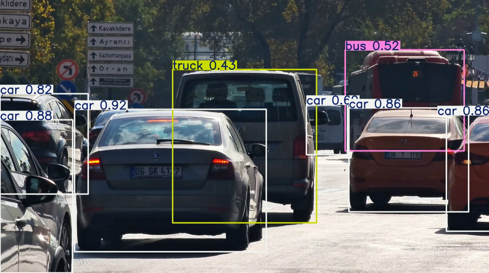
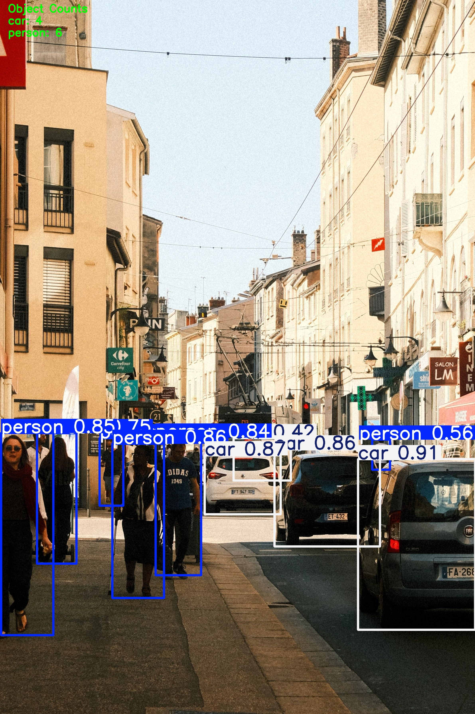
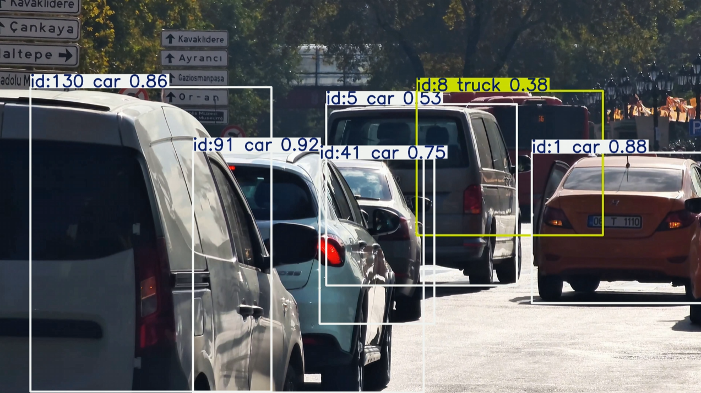

# YOLO Object Detection and Counting Demo

This project implements a YOLO-based object detection and counting pipeline using Python and OpenCV.

## Features

- Image object detection
- Video object detection
- Object counting on images
- Object counting on videos
- Output image and video saving
- Object tracking with ByteTrack

## Tech Stack

- Python
- OpenCV
- YOLOv8
- Ultralytics
- ByteTrack

## Project Structure

```text
ros2-cv-perception/
├── src/
├── data/
├── outputs/
└── docs/
```

## How to Run

Image detection:

```bash
python src/test_yolo_image.py
```

Video detection:

```bash
python src/detect_video.py
```

Image counting:

```bash
python src/count_objects.py
```

Video counting:

```bash
python src/count_video.py
```

Object tracking:

```bash
python src/track_video.py
```

## Results

The output results are saved in:

```text
outputs/
├── image_detection/
├── video_detection/
├── counting_image/
├── counting_video/
└── tracking_video/
```

## Demo

### Object Detection



### Object Counting



### Object tracking

