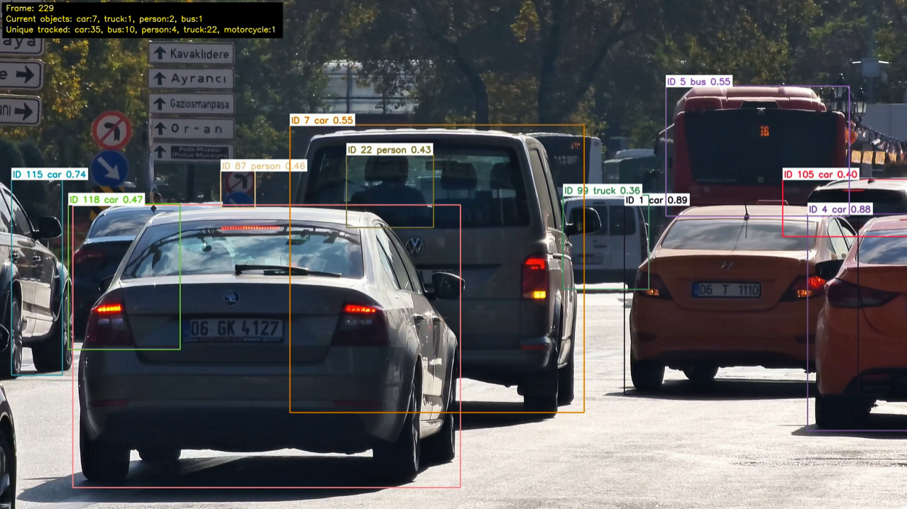

# ROS2-Based Traffic Perception Pipeline

This project implements a vision-based perception pipeline for traffic-scene understanding and autonomous driving scenarios. It integrates YOLOv8, ByteTrack, OpenCV, and ROS2 Jazzy to support object detection, multi-object tracking, object counting, trajectory visualization, CSV result export, and ROS2 topic-based image processing.

The project includes both standalone Python scripts and a ROS2-based perception workflow. The standalone scripts are used for quick testing and result generation, while the ROS2 package simulates a robotics-style perception pipeline using image topics and perception result topics.

## Features

* Image object detection using YOLOv8
* Video object detection using OpenCV
* Object counting on images and videos
* Multi-object tracking using ByteTrack
* Traffic-related class filtering
* Tracking ID visualization
* Frame-level object counting
* Unique tracked-object counting
* Optional object trajectory visualization
* CSV export of frame-level detection and tracking results
* ROS2 image publishing from video input
* ROS2 traffic perception node with YOLOv8 and ByteTrack
* ROS2 annotated image publishing
* ROS2 summary publishing through topics

## Tech Stack

* Python
* OpenCV
* YOLOv8 / Ultralytics
* ByteTrack
* ROS2 Jazzy
* Ubuntu 24.04 / WSL2
* cv_bridge
* sensor_msgs
* std_msgs

## Project Structure

```text
ros2-cv-perception/
├── src/                              # Standalone Python scripts
│   ├── test_yolo_image.py
│   ├── detect_video.py
│   ├── count_objects.py
│   ├── count_video.py
│   ├── track_video.py
│   └── traffic_perception_demo.py
│
├── data/                             # Local input images and videos
├── outputs/                          # Generated detection, counting, and tracking results
├── docs/                             # Demo images and documentation assets
│
├── ros2_cv_perception/               # ROS2 package
│   ├── cv_perception/
│   │   ├── hello_node.py
│   │   ├── image_publisher_node.py
│   │   ├── yolo_detector_node.py
│   │   └── traffic_perception_node.py
│   ├── package.xml
│   ├── setup.py
│   ├── resource/
│   └── test/
│
├── requirements.txt
├── .gitignore
└── README.md
```

## Standalone Traffic Perception Demo

The main standalone demo is:

```bash
python src/traffic_perception_demo.py
```

This script runs a complete traffic-scene perception pipeline on a local video file.

### Input

Put a traffic-scene video at:

```text
data/input.mp4
```

### Output

The generated results are saved under:

```text
outputs/traffic_perception_demo/
```

The output files include:

```text
traffic_perception_demo.mp4
tracking_results.csv
```

### Supported Traffic Classes

The current demo focuses on traffic-related COCO classes:

* person
* bicycle
* car
* motorcycle
* bus
* truck
* traffic light
* stop sign

### CSV Output

The CSV file stores frame-level detection and tracking results.

| Column             | Meaning                           |
| ------------------ | --------------------------------- |
| frame_id           | Frame index in the input video    |
| track_id           | Tracking ID assigned by ByteTrack |
| class_name         | Detected object class             |
| confidence         | YOLOv8 detection confidence       |
| x1, y1, x2, y2     | Bounding box coordinates          |
| center_x, center_y | Center point of the bounding box  |

## Other Standalone Scripts

The repository also contains smaller standalone scripts for testing individual functions.

### Image Detection

```bash
python src/test_yolo_image.py
```

### Video Detection

```bash
python src/detect_video.py
```

### Image Object Counting

```bash
python src/count_objects.py
```

### Video Object Counting

```bash
python src/count_video.py
```

### Object Tracking

```bash
python src/track_video.py
```

## Demo Results

### Traffic Perception Demo



The demo visualizes traffic-related object detection, tracking IDs, object counting, and frame-level perception results.

### Object Detection


### Object Counting


### Object Tracking


## ROS2 Perception Pipeline

This project includes a ROS2-based perception workflow. The ROS2 pipeline converts a video file into image messages, publishes them to `/image_raw`, performs YOLOv8-based perception in a separate node, and publishes annotated images and tracking summaries.

### Basic ROS2 YOLO Detection Pipeline

```text
Video File
    ↓
image_publisher_node
    ↓
/image_raw
    ↓
yolo_detector_node
    ↓
/detections
```

### Full ROS2 Traffic Perception Pipeline

```text
Video File
    ↓
image_publisher_node
    ↓
/image_raw
    ↓
traffic_perception_node
    ↓
/traffic_perception/annotated_image
/traffic_perception/summary
```

## ROS2 Nodes

### image_publisher_node

This node reads frames from a local video file using OpenCV and publishes them as ROS2 image messages.

Published topic:

```text
/image_raw
```

Message type:

```text
sensor_msgs/msg/Image
```

### yolo_detector_node

This node subscribes to `/image_raw`, converts ROS2 image messages into OpenCV images using `cv_bridge`, runs YOLOv8 inference, and publishes detection count results.

Subscribed topic:

```text
/image_raw
```

Published topic:

```text
/detections
```

Message type:

```text
std_msgs/msg/String
```

Example output:

```text
Detected 8 objects.
Detected 7 objects.
Detected 5 objects.
```

### traffic_perception_node

This node subscribes to `/image_raw`, runs YOLOv8 detection and ByteTrack multi-object tracking, filters traffic-related classes, visualizes bounding boxes and tracking IDs, and publishes both annotated images and text summaries.

Subscribed topic:

```text
/image_raw
```

Published topics:

```text
/traffic_perception/annotated_image
/traffic_perception/summary
```

Message types:

```text
sensor_msgs/msg/Image
std_msgs/msg/String
```

Example summary output:

```text
Frame 30 | Current objects: car:5, truck:2, person:1 | Unique tracked: car:9, truck:5, person:1, bus:1
```

## Running the ROS2 Pipeline

The ROS2 package should be built inside a ROS2 workspace.

Example workspace structure:

```text
~/ros2_ws/
├── src/
│   └── ros2_cv_perception/
├── build/
├── install/
└── log/
```

Build the package:

```bash
cd ~/ros2_ws
colcon build --packages-select cv_perception
source install/setup.bash
```

### Terminal 1: Start the Image Publisher

```bash
cd ~/ros2_ws
source install/setup.bash
ros2 run cv_perception image_publisher_node
```

### Terminal 2: Start the Traffic Perception Node

```bash
cd ~/ros2_ws
source install/setup.bash
ros2 run cv_perception traffic_perception_node
```

### Terminal 3: Monitor the Summary Topic

```bash
cd ~/ros2_ws
source install/setup.bash
ros2 topic echo /traffic_perception/summary
```

### Terminal 4: View Annotated Images

```bash
cd ~/ros2_ws
source install/setup.bash
ros2 run rqt_image_view rqt_image_view /traffic_perception/annotated_image
```

## ROS2 Topics

You can check active topics with:

```bash
ros2 topic list
```

Expected topics include:

```text
/image_raw
/detections
/traffic_perception/annotated_image
/traffic_perception/summary
/parameter_events
/rosout
```

You can check the image publishing rate with:

```bash
ros2 topic hz /image_raw
```

You can inspect the annotated image topic with:

```bash
ros2 topic info /traffic_perception/annotated_image
```

Expected type:

```text
sensor_msgs/msg/Image
```

## Installation

Install Python dependencies for the standalone scripts:

```bash
pip install -r requirements.txt
```

For the ROS2 part, the project was tested with:

```text
Ubuntu 24.04
ROS2 Jazzy
Python 3.12
WSL2
```

Required ROS2 packages include:

```bash
sudo apt install -y ros-jazzy-cv-bridge ros-jazzy-vision-opencv
```

For image visualization:

```bash
sudo apt install -y ros-jazzy-rqt-image-view
```

Ultralytics YOLO can be installed with:

```bash
pip install ultralytics
```

ByteTrack may require the `lap` package:

```bash
pip install "lap>=0.5.12"
```

For quick testing on Ubuntu 24.04, `--break-system-packages` may be needed due to the externally managed Python environment:

```bash
pip install ultralytics --break-system-packages
pip install "lap>=0.5.12" --break-system-packages
```

If `cv_bridge` reports a NumPy compatibility issue, use NumPy 1.x:

```bash
pip install "numpy<2" --force-reinstall --break-system-packages
```

## Notes

Large model weights, raw videos, and generated output videos are not tracked in this repository. Files such as `.pt`, `.mp4`, `.avi`, and output folders should be excluded through `.gitignore` to keep the repository lightweight.

Recommended ignored files include:

```text
*.pt
*.mp4
*.avi
*.mov
outputs/
__pycache__/
```

## Current Status

The current project supports both standalone computer vision scripts and a ROS2-based traffic perception pipeline. The standalone pipeline supports traffic-scene object detection, multi-object tracking, object counting, optional trajectory visualization, and CSV result export. The ROS2 pipeline has been tested with video input, image topic publishing, YOLOv8 and ByteTrack inference, annotated image publishing, and tracking summary publishing.

## Limitations

The current pipeline is based on YOLOv8n and ByteTrack. In complex traffic scenes, false detections and ID switches may occur, especially under occlusion, reflections, small objects, and distant vehicles. The tracking count may be higher than the actual number of objects because the same object can receive multiple tracking IDs after occlusion or re-detection.

## Future Work

* Add launch files for starting the full ROS2 pipeline with one command
* Add configurable parameters for video path, confidence threshold, and visualization options
* Export ROS2 tracking results to CSV
* Add region-of-interest based traffic counting
* Evaluate the pipeline on public autonomous driving datasets such as KITTI or BDD100K
* Add failure case analysis for occlusion, small objects, and ID switching
* Extend the perception pipeline toward sensor fusion or 3D perception in future work
